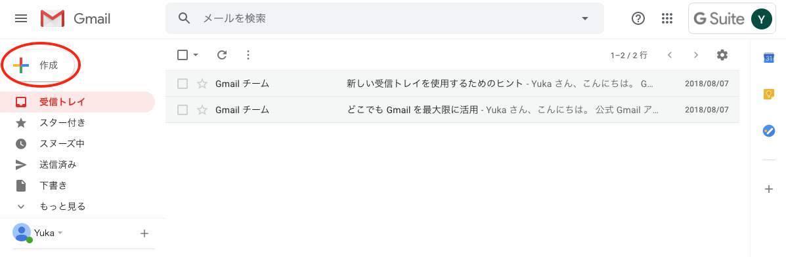

## 東京女子大学のメールシステム

電子メールは，インターネットを通じて世界中とメッセージの交換ができるシステムです．大学や学科・専攻からの重要な連絡事項の多くは，電子メールで皆さんに周知されます．授業によっては，課題を電子メールで提出することもあるでしょう．このページの内容をよく読み，確実に電子メールのやりとりができるように準備をしておいてください．また，1日1回は重要なメールが届いていないかどうか，確認するようにしてください．
 
 

#### 電子メールアドレス

電子メールではメッセージを送る相手を，電子メールアドレス（E-mail address）で指定します．一般に，電子メールアドレスは，**ログイン名@ドメイン名** という形式になっています．ログイン名は，アカウント名などと呼ばれることもあります．東京女子大学の場合，ログイン名が knnx1001 の学生の電子メールアドレスは，**knnx1001@cis.twcu.ac.jp** となります．@（アットマーク）より後ろの部分は全学共通で，東京女子大学の学生が使うドメイン名になっています．メールの宛先を指定するときは，間違いがないよう十分注意してください．
 
 

#### 東女Gmail

東女Gmailは，東京女子大学が学生の教育用に用意しているメールシステムです．このメールはGoogleが提供しているG Suite for Educationというサービスのメールです．そのため，使用方法はフリーメールであるGmailとほぼ同様ですが，利用できる人や社会的信用度が大きく異なります．ドメイン名は gmail.com ではなく，cis.twcu.ac.jp ですし，メールアドレスの利用者は東京女子大学の関係者に限られます．

メールの読み書きにはWebブラウザを用います．そのため，自宅のWindowsマシンやMac，スマートフォンやタブレットPCなどから読み書きすることが可能です．
 
 
 

## 使ってみる

東女Gmailにはいろいろな機能がありますが，詳しい使い方については，全学必修科目である「情報処理技法（リテラシ）I」で学ぶことになります．ここでは，メールの読み書きができるようになるための，最小限の手順を説明します．
 
 

#### ログインの方法

PCやMacのWebブラウザを立ち上げ，**[Gmailへのログイン方法](https://sites.google.com/cis.twcu.ac.jp/cisqa/mail/gmail-cannot_login){:target="_blank"}** に従ってログインしてください．スマートフォンアプリを用いて東女Gmailにログインすることもできます．その場合は，**[Gmailにログインする（Android）](https://support.google.com/mail/answer/8494?hl=ja&ref_topic=7065107&co=GENIE.Platform%3DAndroid&oco=1){:target="_blank"}**，**[Gmailにログインする（iPhoneとiPad）](https://support.google.com/mail/answer/8494?hl=ja&ref_topic=7065107&co=GENIE.Platform%3DiOS&oco=1){:target="_blank"}** を参考にしてください．
 
 

#### メールを作成して送信する

新しくメールを書く場合は，まず左側のメニューの上にある「作成」をクリックします．

そうすると，画面が変わって以下のようになるので，宛先の欄にメールアドレスを，件名の欄に件名を書き，ウィンドウ下部の一番大きな領域にメッセージの本体を書きます．宛先にメールアドレスを入力するときは，半角英数字モードにしておきましょう．

メッセージを書き終わったら，「送信」をクリックしてメッセージを送信します．

 

#### メールを読む

受信トレイに届いたメールが新着順に上から表示されています．新着メールは定期的，自動的にチェックされ，新しいものが上に積み重ねられていきます．届いたメールを読むには，読みたいメールをクリックします．メールの一覧に戻るには画面左上にある左向きの矢印アイコンをクリックするか，「受信トレイ」をクリックします．
 
 

#### メールに返信する

受け取ったメッセージに返信するには，返信したいメッセージを選択して，表示させた状態でメッセージのすぐ下にある「返信」をクリックします．するとメッセージの下に新しいウィンドウが開いて返信のメールを書くことができます．このとき元のメールの本文と日付，時刻，差出人の名前が引用された状態になります．メッセージを書き終わったら「送信」ボタンを押せば返信作業が完了します．
 
 
 

## 電子メール利用の注意事項

通常の電子メールは，葉書郵便と同程度の秘匿性しか持っていません．封書による郵便の場合は，通信内容は秘匿性が保持されますが，葉書郵便の場合，通信内容は第三者でも見ることができてしまいます（例えば，郵便配送業務に関わる人など）．電子メールもインターネット上で配送される際に，通信内容はそのままネットワーク上を流れます．

例えば，自分の銀行口座の暗証番号などをメールで流すのは大変危険です．自分のパスワードも流してはいけません．あなたのパスワードがバレると，それを使って東京女子大学の基幹システムに侵入することができます．このことは，一ユーザの被害に留まらず，東京女子大学全体を危機に陥れる可能性があることを十分念頭に置いて，パスワードの管理は慎重にしてください．
 
 
 

**[トップページに戻る](./index.md)**