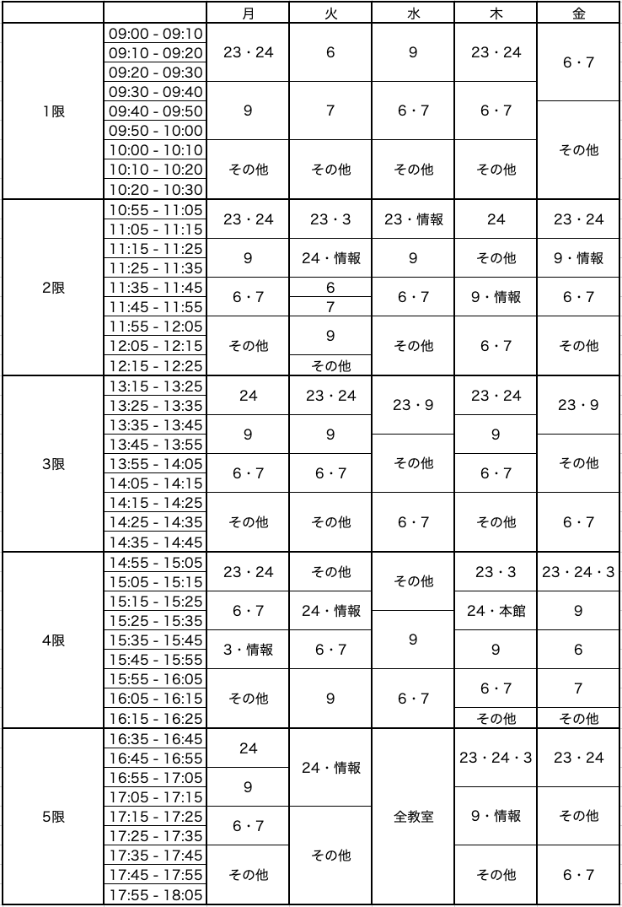


 

**（更新日：2020年4月27日）**
 
 

# WebClassへのアクセス制限について

**WebClass** への負荷集中を回避し，円滑な授業運営を行うために，**WebClassアクセスルール** を作成しました．**必ずこのルールを守ってください．**

- 自分が出席している授業においては，教室ごとにアクセス可能時間帯が割り当てられています．**授業の担当教員の指示に従い**，許可があった時間帯のみWebClassにアクセスするようにしてください．

- それ以外の**授業時間帯（月〜金，9:00〜18:05）**は，教員，学生ともに **WebClassへのアクセスを禁止** します．

- 授業時間以外の時間帯においては，学科ごとに，以下に示す **アクセス禁止時間帯** があります．課題の提出や授業資料のダウンロード等は，これらの時間帯を避けて行ってください．

- アクセス可能時間帯であっても，WebClassにつながりにくい状況が発生する可能性があります．その場合は，何度も続けざまにアクセスを試みることをせずに，しばらく時間を置いてから，再度アクセスするようにしてください．
 
 
 

## アクセス禁止時間帯

- 以下は **アクセス禁止** 時間帯です．ここに示した時間帯にはアクセスしないようにしてください．課題の提出等，時間に十分な余裕を見て，計画的に行ってください． 
「なし」と書かれた曜日は，一日中アクセス可能です．
 
 

##### 国際英語学科，人文学科・英語文学文化専攻 
- **月**：&nbsp;&nbsp;&nbsp;&nbsp;&nbsp;&nbsp;&nbsp;&nbsp;&nbsp;8:30 -- 18:30
- **火〜金**：&nbsp; 8:30 -- 23:59
- **土**：&nbsp;&nbsp;&nbsp;&nbsp;&nbsp;&nbsp;&nbsp;&nbsp;&nbsp;なし
- **日**：&nbsp;&nbsp;&nbsp;&nbsp;&nbsp;&nbsp;&nbsp;&nbsp;&nbsp;13:30 -- 23:59
 
 

---

##### 人文学科（英語文学文化専攻を除く） 
（哲学専攻，日本文学専攻，歴史文化専攻，史学専攻）
- **月**：&nbsp;&nbsp;&nbsp;&nbsp;&nbsp;&nbsp;&nbsp;&nbsp;&nbsp;8:30 -- 23:59
- **火**：&nbsp;&nbsp;&nbsp;&nbsp;&nbsp;&nbsp;&nbsp;&nbsp;&nbsp;8:30 -- 18:30
- **水〜金**：&nbsp; 8:30 -- 23:59
- **土**：&nbsp;&nbsp;&nbsp;&nbsp;&nbsp;&nbsp;&nbsp;&nbsp;&nbsp;なし
- **日**：&nbsp;&nbsp;&nbsp;&nbsp;&nbsp;&nbsp;&nbsp;&nbsp;&nbsp;13:30 -- 23:59
 
 

---

##### 国際社会学科 
（国際関係専攻，経済学専攻，社会学専攻，コミュニティ構想専攻）
- **月，火**：&nbsp; 8:30 -- 23:59
- **水**：&nbsp;&nbsp;&nbsp;&nbsp;&nbsp;&nbsp;&nbsp;&nbsp;&nbsp;8:30 -- 18:30
- **木，金**：&nbsp; 8:30 -- 23:59
- **土**：&nbsp;&nbsp;&nbsp;&nbsp;&nbsp;&nbsp;&nbsp;&nbsp;&nbsp;13:30 -- 23:59
- **日**：&nbsp;&nbsp;&nbsp;&nbsp;&nbsp;&nbsp;&nbsp;&nbsp;&nbsp;なし
 
 

---

##### 心理・コミュニケーション学科，人間科学科 
（心理学専攻，コミュニケーション専攻，言語科学専攻）
- **月〜水**：&nbsp; 8:30 -- 23:59
- **木**：&nbsp;&nbsp;&nbsp;&nbsp;&nbsp;&nbsp;&nbsp;&nbsp;&nbsp;8:30 -- 18:30
- **金**：&nbsp;&nbsp;&nbsp;&nbsp;&nbsp;&nbsp;&nbsp;&nbsp;&nbsp;8:30 -- 23:59
- **土**：&nbsp;&nbsp;&nbsp;&nbsp;&nbsp;&nbsp;&nbsp;&nbsp;&nbsp;13:30 -- 23:59
- **日**：&nbsp;&nbsp;&nbsp;&nbsp;&nbsp;&nbsp;&nbsp;&nbsp;&nbsp;なし
 
 

---

##### 数理科学科 
（数学専攻，情報理学専攻）
- **月**：&nbsp;&nbsp;&nbsp;&nbsp;&nbsp;&nbsp;&nbsp;&nbsp;&nbsp;8:30 -- 18:30
- **火〜金**：&nbsp; 8:30 -- 23:59
- **土**：&nbsp;&nbsp;&nbsp;&nbsp;&nbsp;&nbsp;&nbsp;&nbsp;&nbsp;なし
- **日**：&nbsp;&nbsp;&nbsp;&nbsp;&nbsp;&nbsp;&nbsp;&nbsp;&nbsp;13:30 -- 23:59
 
 

---

##### 大学院人間科学研究科，理学研究科
- **月**：&nbsp;&nbsp;&nbsp;&nbsp;&nbsp;&nbsp;&nbsp;&nbsp;&nbsp;8:30 -- 18:30
- **火，水**：&nbsp; 8:30 -- 23:59
- **木，金**：&nbsp; 8:30 -- 18:30
- **土**：&nbsp;&nbsp;&nbsp;&nbsp;&nbsp;&nbsp;&nbsp;&nbsp;&nbsp;なし
- **日**：&nbsp;&nbsp;&nbsp;&nbsp;&nbsp;&nbsp;&nbsp;&nbsp;&nbsp;なし
 
 

---

 

## 参考：授業時間内のアクセス可能時間帯

- 曜日・時限・教室ごとにアクセス可能時間帯が決まっています．参考にしてください．
- 表の中の番号は教室のある建物を表します．例えば「24」は24号館のことです．表の中に該当教室がない場合は，「その他」の時間帯がアクセス可能時間帯になります．

 
 
**[トップページに戻る](./index.md)**